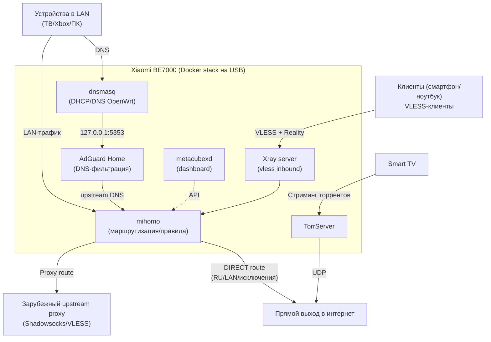

# xiaomi-be7000-setup

DevOps-ориентированный конфигуратор для Xiaomi BE7000 (стоковая прошивка на базе OpenWrt): Docker Compose, **Xray (VLESS+Reality)**, **mihomo**, **AdGuard Home**, **TorrServer**, автозапуск через UCI firewall include, бэкап/откат и smoke-проверки. Что умеет:

- устанавливает селективный Proxy клиент [Mihomo](https://github.com/MetaCubeX/mihomo/tree/Alpha), с настройками маршрутизации на основе [re:filter](https://github.com/1andrevich/Re-filter-lists) и [Geosite](https://github.com/v2fly/domain-list-community/tree/master), до вашего proxy-сервера (Shadowsocks или Vless, для развертывания сервера можно использовать [https://getoutline.org/ru/](https://getoutline.org/ru/))
- [Mihomo Dashboard](https://github.com/MetaCubeX/metacubexd) — интерфейс для мониторинга вашего Mihomo-клиента
- [AdGuard Home](https://github.com/AdguardTeam/AdGuardHome) — DNS-фильтрация (реклама/трекинг/вредоносные домены) с автоматической интеграцией в `dnsmasq`
- устанавливает Xray-сервер для того, чтобы вы могли подключаться к своему роутеру из внешней сети (например, со своего смартфона), используя роутер, как шлюз для Shadowsocks-прокси с маршрутизацией трафика
- бонусом: устанавливает [TorrServer](https://github.com/yourok/torrserver) для просмотра торрентов в домашней сети в реальном времени, например, со SmartTV

В итоге, ваш роутер сможет маршрутизировать трафик в домашней сети, обходя ограничения "с обоих сторон" (в том числе, сервисов, которые заблокировали доступ для российских пользователей) через Shadowsocks и проксируя напрямую весь отечественный трафик (банки, госсервисы). 

Помимо этого, если у вас есть белый IP, вы можете настроить роутер как Xray-сервер для подключения своих смартфонов, чтобы использовать настроенные правила маршрутизации без необходимости выключать proxy-клиент при использовании отечественных сервисов.

В качестве зависимости, конфигуратор использует [xmir-patcher](https://github.com/openwrt-xiaomi/xmir-patcher) (эксплойт/доступ к устройству и постоянный dropbear) для получения ssh-доступа к роутере.

## Архитектура




## Требования

- **Python** 3.10+ и [Poetry](https://python-poetry.org/)
- [go-task](https://taskfile.dev/) (опционально, удобная обёртка над CLI)
- Роутер с уже включённым **Docker** через веб-интерфейс и привязанным **USB** (как хранилище mi_docker)
- Для первичного доступа без SSH — репозиторий [xmir-patcher](https://github.com/openwrt-xiaomi/xmir-patcher) (подключается как git submodule)

## Быстрый старт

```bash
git clone --recurse-submodules git@github.com:tonatos/xiaomi-be7000-setup.git xiaomi-be7000-setup
cd xiaomi-be7000-setup
poetry install
```

Скопируйте конфиги:

```bash
cp config/router.example.yaml config/router.yaml
# Отредактируйте router.yaml: host, пароль SSH, UUID, Reality-ключи,
# upstream для mihomo и секцию adguardhome (приложение AGH; контейнер — services.adguardhome)
```

Если у вашего роутера еще не настроен ssh, то воспользуйтесь инструкцией из [следующей секции](#ssh-с-нуля-xmir-patcher).

`config/router.base.yaml` подгружается автоматически, а `config/router.yaml` переопределяет любые его поля.

Для добавления собственных контейнеров используйте `services.custom` в `router.yaml`:
каждый элемент этой секции вставляется в общий `docker-compose.yml` как обычный
`services.<name>` из Docker Compose. Smoke-проверки по умолчанию выполняются только
для встроенных сервисов проекта.

Укажите данные вашего proxy-сервера в секции `mihomo.proxies` файла `config/router.yaml`. Вот пример для Shadowsocks ghjnj:
```
proxies:
  - name: "upstream"
    type: ss                        # тип прокси (vless/shadowsocks)
    server: 77.111.111.111          # IP вашего сервера
    port: 34414                     # порт
    cipher: chacha20-ietf-poly1305  # cipher
    password: "YOU_PASSWORD"        # пароль
    udp: true
    ip-version: ipv4
```

Настройки указывать в соответствии с документацией [Mihomo](https://wiki.metacubex.one/ru/config/proxies/).

Переменные окружения (перекрывают YAML): `ROUTER_HOST`, `ROUTER_SSH_PASSWORD`, `ROUTER_SSH_PORT`, `ROUTER_SSH_USER`, `ROUTER_PUBLIC_HOST`.

### SSH с нуля (xmir-patcher)

Если порт **22 закрыт**, после `git submodule update --init third_party/xmir-patcher`:

```bash
task bootstrap-ssh
# или
poetry run pip install -r third_party/xmir-patcher/requirements.txt
poetry run xiaomi-router bootstrap-ssh
```

Последовательно вызываются `connect.py <IP>` и `install_ssh.py` из [xmir-patcher](https://github.com/openwrt-xiaomi/xmir-patcher) (эксплойт/доступ к устройству и постоянный dropbear). Может понадобиться пароль веб-интерфейса Xiaomi — следуйте подсказкам скриптов upstream.

### Окружение на USB (однократно)

По желанию, с рабочего SSH:

```bash
task setup-shell-env    # shell PATH (docker / compose / opkg, если доступны)
task setup-entware      # опционально, Entware в bind-mount /opt на USB
task setup-compose      # плагин docker compose на USB
```

Что это значит:

- `setup-shell-env` — создаёт `/mnt/usb-*/opt/usb-env.sh` и idempotent-хук в `/etc/profile`, чтобы при каждом SSH-логине автоматически подхватывались `docker` / `docker compose` / `opkg` (если доступны в системе).
- `setup-entware` — устанавливает Entware на USB (дополнительная экосистема Linux-пакетов в `/opt`) и сохраняет wrapper `opkg-usb` для штатного `/bin/opkg` роутера в `$USB/opt/bin/opkg-usb`.  
  Это отдельная "мини-система" с собственным набором пакетов и утилит.

Когда что запускать:

- Если нужен только деплой этого проекта, начните с `task deploy`: он сам проверит `docker compose` и при необходимости установит его.
- `setup-shell-env` полезен почти всегда, если вы регулярно заходите на роутер по SSH.
- `setup-entware` нужен, когда вам действительно нужны пакеты Entware (`/opt/bin/opkg` и экосистема `/opt`).

`task deploy` сам подготавливает shell env (`usb-env.sh` + `/etc/profile` hook) и проверяет наличие `docker compose` на роутере.  
Если compose отсутствует, запускается автоустановка (`setup-compose`), а при неуспехе — попытка `setup-entware` и повторная установка compose.

### Деплой стека

Команда копирует необходимые конфиги, скрипты с правилами маршрутизации, развертывает docker-контейнеры, настраивает `dnsmasq -> AdGuard Home` через UCI и проверяет работоспособность.

```bash
task deploy
# или
poetry run xiaomi-router deploy
```

Опции деплоя:

- `--skip-smoke` — не запускать smoke-проверки после `docker compose up`.
- `--no-rollback-on-smoke-fail` — если smoke не прошёл, завершить deploy ошибкой, но не выполнять `docker compose down` и rollback.

Перед изменениями на USB создаётся архив в `$USB/backups/`, а также `uci export firewall` и `uci export dhcp`; по умолчанию при ошибке smoke выполняются `docker compose down`, затем откат файлов и импорт сохранённых `firewall`/`dhcp`.

Доступные эндпоинты, после развертывания полного стека:
- [http://192.168.31.1:3000](http://192.168.31.1:3000) — AdGuard
- [http://192.168.31.1:9099](http://192.168.31.1:9099) — Mihomo Dashboard Metacube
- [http://192.168.31.1:8090](http://192.168.31.1:8090/) — Torrserver

### Полезные команды

| Команда | Назначение |
| --- | --- |
| `task install` | Установить Python-зависимости (`poetry install`) |
| `task bootstrap-ssh` | Поднять SSH через `xmir-patcher`, если порт 22 недоступен |
| `task render` | Локальный рендер в `build/rendered` (USB-заглушка) |
| `task render-live` | Рендер с определением USB по SSH |
| `task deploy` | Полный деплой (backup, upload, UCI, compose up, smoke) |
| `task smoke` | Проверки портов и `docker compose` на роутере |
| `task sync-pull` | Скачать конфиги со стека в `build/synced-from-router` |
| `task sync-push` | Залить `build/rendered` и выполнить `docker compose up -d` |
| `task rollback -- path/to/deploy-....json` | Откат по метаданным deploy (JSON с роутера) |
| `task diagnose` | Сводка по состоянию `mi_docker` / USB |
| `task vless-link` | Напечатать VLESS (Reality) ссылку для клиента |
| `task setup-shell-env` | Настроить `usb-env.sh` и автоподхват env в SSH (`/etc/profile`) |
| `task setup-entware` | Установить Entware на USB (`/opt` через bind mount) |
| `task setup-compose` | Установить compose plugin в `$USB/opt/docker-cli` |

CLI-эквиваленты (без `task`):

```bash
poetry run xiaomi-router {bootstrap-ssh, render, ...}
```


Пример отката (JSON лежит на роутере в `$USB/backups/`):

```bash
scp root@192.168.31.1:/mnt/usb-*/backups/deploy-*.json ./
task rollback ./deploy-....json
```

## Структура репозитория

- `config/router.example.yaml` — основной пример (в git)
- `config/router.base.yaml` — базовые системные значения (в git)
- `config/router.yaml` — ваш файл (в `.gitignore`)
- `templates/` — Jinja2-шаблоны: xray, mihomo, compose, autorun-скрипты
- `src/xiaomi_router/` — Python CLI
- `third_party/xmir-patcher` — submodule

На USB создаётся каталог `stack/` (имя задаётся в `stack.relative_dir`): `docker-compose.yml`, `configs/xray`, `configs/mihomo`, `configs/adguardhome`, `mihomo/mihomo-routing.sh`. По умолчанию туда же разворачивается `metacubexd` (веб-дашборд Mihomo) на порту `9099` роутера.

## AdGuard Home: настройка и рекомендации

Проект разворачивает контейнер `AdGuard Home` (`services.adguardhome`) и конфиг приложения в секции `adguardhome` (порты, upstream DNS, прокси и т.д.). При `deploy` `dnsmasq` переключается на локальный upstream `127.0.0.1#5353` (или `adguardhome.dns_host`/`adguardhome.dns_port`).

### Фильтр-листы «из коробки» (актуально для текущей AGH)

По текущим дефолтам в исходниках `AdGuard Home`:

- `AdGuard DNS filter` включен по умолчанию;
- `AdGuard Russian filter` присутствует, включен по умолчанию.
- `AdAway Default Blocklist` присутствует, но выключен.

В проекте эти же дефолты закладываются в рендер `configs/adguardhome/conf/AdGuardHome.yaml`.

## VLESS и «белый» IP

Вы можете использовать ваш роутер как Xray-сервер для внешних клиентов (например, смартфонов) для того, чтобы маршрутизировать трафик по правилам, сконфигурированным в `Mihomo` (в частности, отправлять запросы к ресурсам с ограничениями через зарубежный proxy-сервер). В качестве клиента можно использовать любой, который поддерживает Vless (Hiddify, V2RayTun, Happ, etc.)

Команда `vless-link` строит ссылку из `public_endpoint.host` (или `--host`) и секретов Reality для подключения. Для доступа **из интернета** нужны:

- проброс порта с WAN на хост роутера (порт inbound Xray, по умолчанию 443);
- у провайдера — публичный («белый») IP или статический адрес на вашем VPS, если вы выкладываете трафик иначе.

Роутер не обязан знать ваш внешний адрес — укажите его вручную в конфиге или в `--host`.

## Прозрачный прокси (iptables)

По умолчанию, весь трафик вашей **не будет** маршрутизироваться в прокси-клиент `Mihomo`, в `router.yaml` секция `routing.apply_iptables` по умолчанию `false`. Чтобы, маршутизировать трафик внутри сети согаласно вашим правилам, ее необходимо включить. Включайте только понимая последствия для вашей LAN (`routing.lan_cidr`).

## Ограничения Xiaomi Docker

Тома и проект Compose должны находиться под путями вида `/mnt/usb-*/…`. В случае, если docker-контейнеры будут ссылаться на пути за пределами `/mnt/usb-*/…`, роутер не запустит docker-демон при перезагрузке.

## Лицензия

MIT