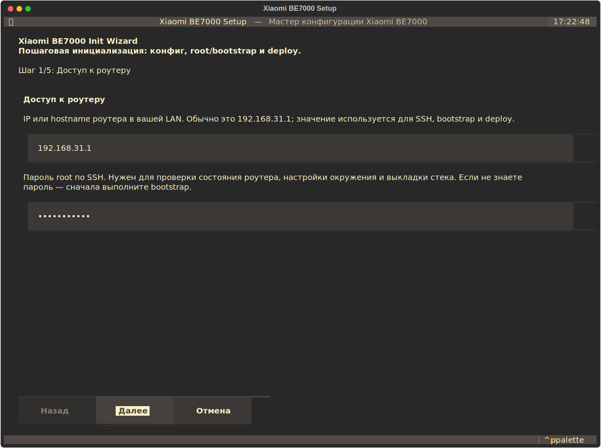

# xiaomi-be7000-setup



- [xiaomi-be7000-setup](#xiaomi-be7000-setup)
  - [Мотивация](#мотивация)
  - [Описание](#описание)
  - [Архитектура](#архитектура)
  - [Требования](#требования)
  - [Как использовать конфигуратор](#как-использовать-конфигуратор)
  - [Быстрый старт](#быстрый-старт)
    - [Mihomo (по умолчанию)](#mihomo-по-умолчанию)
    - [Переключение Mihomo на V2rayA](#переключение-mihomo-на-v2raya)
    - [SSH с нуля (xmir-patcher)](#ssh-с-нуля-xmir-patcher)
    - [Деплой стека](#деплой-стека)
    - [Окружение на USB (однократно)](#окружение-на-usb-однократно)
    - [Переменные окружения](#переменные-окружения)
    - [Управление прокси Mihomo](#управление-прокси-mihomo)
    - [Команды](#команды)
  - [Структура репозитория](#структура-репозитория)
  - [Подлключение собственных docker-контейнеров](#подлключение-собственных-docker-контейнеров)
  - [AdGuard Home: настройка и рекомендации](#adguard-home-настройка-и-рекомендации)
    - [Фильтр-листы «из коробки» (актуально для текущей AGH)](#фильтр-листы-из-коробки-актуально-для-текущей-agh)
  - [Роутер как Xray-сервер для внешних устройств](#роутер-как-xray-сервер-для-внешних-устройств)
  - [Прозрачный прокси](#прозрачный-прокси)
    - [Mihomo (TUN-режим, по умолчанию)](#mihomo-tun-режим-по-умолчанию)
    - [v2rayA](#v2raya)
    - [Откат при потере интернета](#откат-при-потере-интернета)
  - [Ограничения Xiaomi Docker](#ограничения-xiaomi-docker)
  - [Ресурсы](#ресурсы)
  - [Лицензия](#лицензия)

## Мотивация

Роутер Xiaomi BE7000 крайне противоречивое с потребительской точки зрения устройство. С одной стороны, он обладает очень мощным железом: 4-ядерный процессор, 1Гб оперативной памяти, порты 2.5 Гбит/с., мощные антены, отличное покрытие, поддержка функций Wi-Fi 7. И как точка доступа он работает прекрасно. С другой стороны, для более глубокой настройки и использования всего потенциала железа у нас возникает огромное количество проблем:
- закрытая китайская прошивка в виде, судя по всему, глубоко переработанного форка OpenWRT
- свежий процессор Qualcomm IPQ95xx становится и минусом - OpenWRT его не поддерживает
- крайне маленькое сообщество, отсутствие пакетов и гайдов

В сравнении с Kinetik / Microtik, которые обладают как встроенными инструментами, так и развитым сообществом, инфраструктурой Entware и подробными гайдами, настроить наиболее востребованные инструменты в нашем случае — огромная проблема.

Тем не менее, выход есть. Благодаря возможности получить ssh-доступ к роутеру, мощному железу и возможности установки Docker, владельцы Xiaomi BE7000 все же могут настроить роутер под многие задачи.

Этот конфигуратор — попытка реализовать all-in-one набор решений для комфортного взаимодействия с роутером на более глубоком уровне без необходимости собирать хаки, bash-скрипты по интернету и мучиться с сетью.

## Описание

DevOps-ориентированный конфигуратор для Xiaomi BE7000 (стоковая прошивка на базе OpenWrt): Docker Compose, **Xray (VLESS+Reality)**, **mihomo**, **AdGuard Home**, **TorrServer**, автозапуск через UCI firewall include, бэкап/откат и smoke-проверки. Что умеет:

- устанавливает селективный Proxy клиент [Mihomo](https://github.com/MetaCubeX/mihomo/tree/Alpha) в **TUN-режиме** (перехватывает TCP и UDP/QUIC из LAN), с настройками маршрутизации на основе [re:filter](https://github.com/1andrevich/Re-filter-lists) и [Geosite](https://github.com/v2fly/domain-list-community/tree/master), до вашего proxy-сервера (Shadowsocks или Vless, для развертывания сервера можно использовать [https://getoutline.org/ru/](https://getoutline.org/ru/))
  - в качестве опции, вместо Mihomo вы можете использовать клиент [v2rayA](https://github.com/v2rayA/v2rayA), если вам привычна настройка клиента и правил через Web GUI
- [Mihomo Dashboard](https://github.com/MetaCubeX/metacubexd) — интерфейс для мониторинга вашего Mihomo-клиента
- [AdGuard Home](https://github.com/AdguardTeam/AdGuardHome) — DNS-фильтрация (реклама/трекинг/вредоносные домены) с автоматической интеграцией в `dnsmasq`
   Xray-сервер для того, чтобы вы могли подключаться к своему роутеру из внешней сети (например, со своего смартфона), используя роутер, как шлюз для Shadowsocks-прокси с маршрутизацией трафика
- настраивает Entware-окружение в `/opt` с живыми репозиториями
- бонусом: устанавливает [TorrServer](https://github.com/yourok/torrserver) для просмотра торрентов в домашней сети в реальном времени, например, со SmartTV

В итоге, ваш роутер сможет маршрутизировать трафик в домашней сети, обходя ограничения "с обоих сторон" (в том числе, сервисов, которые заблокировали доступ для российских пользователей) через Shadowsocks и проксируя напрямую весь отечественный трафик (банки, госсервисы). 

Помимо этого, если у вас есть белый IP, вы можете настроить роутер как Xray-сервер для подключения своих смартфонов, чтобы использовать настроенные правила маршрутизации без необходимости выключать proxy-клиент при использовании отечественных сервисов.

В качестве зависимости, конфигуратор использует [xmir-patcher](https://github.com/openwrt-xiaomi/xmir-patcher) (эксплойт/доступ к устройству и постоянный dropbear) для получения ssh-доступа к роутеру.


## Архитектура

```mermaid
flowchart TD
  UserClient["Клиенты (смартфон/ноутбук)\nVLESS-клиенты"] -->|"VLESS + Reality"| Xray
  LanDevices["Устройства в LAN\n(ТВ/Xbox/ПК)"] -->|"LAN-трафик"| Mihomo
  LanDevices -->|"DNS"| Dnsmasq
  Dnsmasq -->|"127.0.0.1:5353"| AdGuard
  SmartTV["Smart TV"] -->|"Стриминг торрентов"| Torr
  Torr -->|"UDP"| Direct["Прямой выход в интернет"]

  subgraph Router["Xiaomi BE7000 (Docker stack на USB)"]
    Xray["Xray server\n(vless inbound)"]
    Mihomo["Mihomo/v2rayA\n(маршрутизация,правила)"]
    AdGuard["AdGuard Home\n(DNS-фильтрация)"]
    Dashboard["metacubexd\n(dashboard)"]
    Dnsmasq["dnsmasq\n(DHCP/DNS OpenWrt)"]
    Torr["TorrServer"]
    Xray --> Mihomo
    AdGuard -->|"upstream DNS"| Mihomo
    Dashboard -. API .-> Mihomo
  end

  Mihomo -->|"Proxy route"| Upstream["Зарубежный upstream proxy\n(Shadowsocks/VLESS)"]
  Mihomo -->|"DIRECT route\n(RU/LAN/исключения)"| Direct["Прямой выход в интернет"]
```




## Требования

- **Python** 3.10+ и [Poetry](https://python-poetry.org/)
- [go-task](https://taskfile.dev/) (опционально, удобная обёртка над CLI)
- Роутер с уже включённым **Docker** через веб-интерфейс и привязанным **USB** (как хранилище mi_docker)
- Для первичного доступа без SSH — репозиторий [xmir-patcher](https://github.com/openwrt-xiaomi/xmir-patcher) (подключается как git submodule)

Предполагается, что вы обладаете базовыми навыками работы с shell, понимаете, что такое ssh, можете склонировать git-репозиторий, в состоянии гуглить ошибки и, при необходимости, консультироваться по ним с ChatGPT/Grok.

Если вы хотите настроить proxy-клиент (mihomo/v2rayA) для получения доступа к ресурсам с ограничениями (например, youtube.com, grok.com), предполагается, что у либо собственный VPS-сервер, где вы настроили xray/shadowsocks самостоятельно, либо предоставленный одним из множества VPN-поставщиков, но совместимый с доступными протоколами.

## Как использовать конфигуратор

Вы можете использовать как отдельные функции конфигуратора для дальнейшей самостоятельной настройки пакетов, такие:
- `task init`: интерактивный мастер (Textual TUI) — экран с формами, генерация/обновление `router.yaml`, опциональный bootstrap SSH и deploy
- `task bootstrap-ssh`: получение ssh-доступа
- `task setup-entware`: установить Entware-инфраструктура (`/opt` через bind mount)
- `task setup-shell-env`: настройка shell-окружения (после активации, команды `docker`, `opkg` и т.п. будут доступны в PATH)
- `task setup-compose`: установить docker compose plugin в `$USB/opt/docker-cli`

Так и управлять всем стеком полностью. Это предполагает, что конфигуратор развернет на роутере необходимые docker-контейнеры с приложениями (proxy-клиент, proxy-сервер, adguardhome, torrrserver и так далее) в соответствии с конфигурацией вашего `router.yaml`, а так же перенастроит сетевые правила маршрутизации трафика.

Порядок работы такой: вносите изменения в `router.yaml` -> `task deploy`, изменения применяются на роутере.

## Быстрый старт

```bash
git clone --recurse-submodules git@github.com:tonatos/xiaomi-be7000-setup.git xiaomi-be7000-setup
cd xiaomi-be7000-setup
poetry install
```

Для быстрого запуска мастера настройки в интерактивном режиме:

```bash
task init
```

Мастер задаст ключевые вопросы по proxy-клиенту, сервисам и deploy, аккуратно обновит только известные поля в `router.yaml` (без затирания ваших ручных секций) и может сразу выполнить полный деплой.  
Если вы заполняете upstream URL для Mihomo (`ss://`, `vless://`, `trojan://`), мастер сразу добавит/обновит `mihomo.proxies`.

Вы так же можете не пользоваться мастером и выполнить конфигурацию вручную. Для этого, скопируйте конфиги:

```bash
cp config/router.example.yaml config/router.yaml
# Отредактируйте router.yaml: host, пароль SSH, UUID, Reality-ключи,
# upstream для mihomo и так далее
```

Если у вашего роутера еще не настроен ssh, то воспользуйтесь инструкцией из [следующей секции](#ssh-с-нуля-xmir-patcher).

`config/router.base.yaml` подгружается автоматически, а `config/router.yaml` переопределяет любые его поля.


### Mihomo (по умолчанию)

Если вы используете Mihomo, то укажите данные вашего proxy-сервера в секции `mihomo.proxies` файла `config/router.yaml`. Вот пример для Shadowsocks прокси:
```
proxies:
  - name: "upstream"
    type: ss                        # тип прокси (vless/shadowsocks)
    server: 77.111.111.111          # IP вашего сервера
    port: 34414                     # порт
    cipher: chacha20-ietf-poly1305  # cipher
    password: "YOUR_PASSWORD"        # пароль
    udp: true
    ip-version: ipv4
```

Настройки указывать в соответствии с документацией [Mihomo Proxies](https://wiki.metacubex.one/ru/config/proxies/). 

`v2rayA` настраивается через Web GUI.

### Переключение Mihomo на V2rayA

В `config/router.yaml`:
```yaml
# Смените proxy-клиент
proxy_client: "v2raya"

services:
  # Отключите mihomo и metacubexd
  mihomo:
    enabled: false
  metacubexd:
    enabled: false
  
  # Включите контейнер с v2raya
  v2raya:
    enabled: true

# Секция mihomo больше не нужна
mihomo: []
```

Для v2rayA рекомендуется **TUN-режим**:

- в `config/router.yaml`: `v2raya.transparent_mode: "tun"` (по умолчанию так и есть в базе);
- `routing.apply_iptables` можно оставить `false` (iptables REDIRECT не нужен).

Режим `redirect` оставлен как legacy-вариант: используйте `v2raya.transparent_mode: "redirect"` и `routing.apply_iptables: true`, тогда `lan-routing.sh` применит TCP REDIRECT на `services.v2raya.redir_port` (по умолчанию 52345).

Рабочие настройки в Web GUI v2rayA, которые нужно задать в интерфейсе:
```
- Прозрачный прокси: Режим разделения трафика такой же, как и у порта с правилами
- Реализация прозрачного прокси/Системного прокси: system tun
- Предотвратить DNS-спуфинг: DoH
- Специальный режим: Выключено (fakedns не работает)
- Сниффер: Http + TLS + Quic
```

### SSH с нуля (xmir-patcher)

Если порт **22 закрыт**, после `git submodule update --init third_party/xmir-patcher` выполните:

```bash
task bootstrap-ssh
# или
poetry run pip install -r third_party/xmir-patcher/requirements.txt
poetry run xiaomi-router bootstrap-ssh
```

Последовательно вызываются `connect.py <IP>` и `install_ssh.py` из [xmir-patcher](https://github.com/openwrt-xiaomi/xmir-patcher) (эксплойт/доступ к устройству и постоянный dropbear). Может понадобиться пароль веб-интерфейса Xiaomi — следуйте подсказкам скриптов upstream.

### Деплой стека

Команда копирует необходимые конфиги, скрипты с правилами маршрутизации, развертывает docker-контейнеры, настраивает `dnsmasq -> AdGuard Home` через UCI и проверяет работоспособность.

```bash
task deploy
# или
poetry run xiaomi-router deploy
```

Опции деплоя:

- `--skip-smoke` — не запускать smoke-проверки после `docker compose up`.
- `--no-rollback-on-smoke-fail` — если smoke не прошёл, завершить deploy ошибкой, но не выполнять `docker compose down` и rollback.

Перед изменениями на USB создаётся архив в `$USB/backups/`, а также `uci export firewall` и `uci export dhcp`; по умолчанию при ошибке smoke выполняются `docker compose down`, затем откат файлов и импорт сохранённых `firewall`/`dhcp`.

Доступные эндпоинты, после развертывания полного стека:
- [http://192.168.31.1:3000](http://192.168.31.1:3000) — AdGuard
- [http://192.168.31.1:9099](http://192.168.31.1:9099) — Mihomo Dashboard Metacube
- [http://192.168.31.1:2017](http://192.168.31.1:2017) — v2rayA
- [http://192.168.31.1:8090](http://192.168.31.1:8090/) — Torrserver

Чтобы подключиться Metacube к Mihomo-серверу, нужно указать адрес `http://192.168.31.1:9010/` (по умолчанию) и секрет, указанный в секции `mihomo.secret` (по умолчанию, пусто).

Обновите базы для Mihomo:
- `Правила` / `Провайдеры правил` — нажать на обновление у обоих, должны подгрузиться базы `re:filter`
- `Конфигурация`, снизу `Обновить базы GEO` — должны обновиться встроенные геобазы

### Окружение на USB (однократно)

По желанию, с рабочего SSH:

```bash
task setup-shell-env    # shell PATH (docker / compose / opkg, если доступны)
task setup-entware      # опционально, Entware в bind-mount /opt на USB
task setup-compose      # плагин docker compose на USB
```

Что это значит:

- `setup-shell-env` — создаёт `/mnt/usb-*/opt/usb-env.sh` и idempotent-хук в `/etc/profile`, чтобы при каждом SSH-логине автоматически подхватывались `docker` / `docker compose` / `opkg` (если доступны в системе).
- `setup-entware` — устанавливает Entware на USB (дополнительная экосистема Linux-пакетов в `/opt`) и сохраняет wrapper `opkg-usb` для штатного `/bin/opkg` роутера в `$USB/opt/bin/opkg-usb`.  
  Это отдельная "мини-система" с собственным набором пакетов и утилит.

Когда что запускать:

- Если нужен только деплой этого проекта, начните с `task deploy`: он сам проверит `docker compose` и при необходимости установит его.
- `setup-shell-env` полезен почти всегда, если вы регулярно заходите на роутер по SSH.
- `setup-entware` нужен, когда вам действительно нужны пакеты Entware (`/opt/bin/opkg` и экосистема `/opt`).

`task deploy` сам подготавливает shell env (`usb-env.sh` + `/etc/profile` hook) и проверяет наличие `docker compose` на роутере.  
Если compose отсутствует, запускается автоустановка (`setup-compose`), а при неуспехе — попытка `setup-entware` и повторная установка compose.


### Переменные окружения

Доступные переменные окружения (переопределяют YAML): 
- `ROUTER_HOST`
- `ROUTER_SSH_PASSWORD`
- `ROUTER_SSH_PORT`
- `ROUTER_SSH_USER`
- `ROUTER_PUBLIC_HOST`

### Управление прокси Mihomo

Команда `add-mihomo-proxy` разбирает ссылку вида `ss://`, `vless://` или `trojan://` и добавляет (или обновляет) прокси в секции `mihomo.proxies` вашего `config/router.yaml`.

**Добавить прокси напрямую в `router.yaml`:**

```bash
task add-mihomo-proxy -- 'ss://Y2hhY2hhMjAtaWV0Zi1wb2x5MTMwNTpwYXNzd29yZA==@1.2.3.4:8388#MyProxy'
# или
poetry run xiaomi-router add-mihomo-proxy 'vless://uuid@host:443?security=reality&pbk=...&sid=...&sni=www.example.com&fp=chrome&flow=xtls-rprx-vision#MyVless'
```

Если прокси с таким именем уже есть в файле — он будет обновлён. Команда использует round-trip редактирование YAML и **сохраняет все существующие комментарии** в файле.

**Задать своё имя:**

```bash
task add-mihomo-proxy -- 'trojan://secret@host:443?sni=example.com#OldName' --name "MyTrojan"
```

**Получить YAML-фрагмент без изменения файла** (флаг `--print`):

```bash
task add-mihomo-proxy -- 'ss://...' --print
# выводит фрагмент YAML для ручной вставки в router.yaml
```

Поддерживаемые транспорты и параметры парсинга:

| Протокол | Транспорт | Параметры из URL |
|----------|-----------|-----------------|
| `ss://` | — | cipher, password, server, port |
| `vless://` | tcp, ws, grpc, xhttp, h2 | security (tls/reality), sni, fp, pbk, sid, flow, alpn, path, host, mode |
| `trojan://` | tcp, ws, grpc | sni, fp, alpn, allowInsecure, path, host |

### Команды

| Команда | Назначение |
| --- | --- |
| **Системные команды** |
| `task install` | Установить Python-зависимости (`poetry install`) |
| `task init` | Интерактивный мастер: заполнение `router.yaml`, опциональный bootstrap SSH и deploy |
| **Управление роутером** |
| `task bootstrap-ssh` | Поднять SSH через `xmir-patcher`, если порт 22 недоступен |
| `task diagnose` | Сводка по состоянию `mi_docker` / USB |
| `task setup-shell-env` | Настроить `usb-env.sh` и автоподхват env в SSH (`/etc/profile`) |
| `task setup-entware` | Установить Entware на USB (`/opt` через bind mount) |
| `task setup-compose` | Установить compose plugin в `$USB/opt/docker-cli` |
| **Управление стеком** |
| `task render` | Локальный рендер в `build/rendered` (USB-заглушка) |
| `task render-live` | Рендер с определением USB по SSH |
| `task deploy` | Полный деплой (backup, upload, UCI, compose up, smoke) |
| `task smoke` | Проверки портов и `docker compose` на роутере |
| `task sync-pull` | Скачать конфиги со стека в `build/synced-from-router` |
| `task sync-push` | Залить `build/rendered` и выполнить `docker compose up -d` |
| `task rollback -- path/to/deploy-....json` | Откат по метаданным deploy (JSON с роутера) |
| **Прокси Mihomo** |
| `task add-mihomo-proxy -- 'URL'` | Добавить/обновить прокси в `mihomo.proxies` из ссылки `ss://`, `vless://`, `trojan://` |
| **Vless-сервер** |
| `task vless-link` | Напечатать VLESS (Reality) ссылку для клиента |
| `task vless-server-setup` | Сгенерировать ключи и клиентов для Xray REALITY на онове вашего текущего `router.yaml` |

CLI-эквиваленты (без `task`):

```bash
poetry run xiaomi-router {init, bootstrap-ssh, render, ...}
```


Пример отката (JSON лежит на роутере в `$USB/backups/`):

```bash
scp root@192.168.31.1:/mnt/usb-*/backups/deploy-*.json ./
task rollback ./deploy-....json
```

## Структура репозитория

- `config/router.example.yaml` — основной пример (в git)
- `config/router.base.yaml` — базовые системные значения (в git)
- `config/router.yaml` — ваш файл (в `.gitignore`)
- `templates/` — Jinja2-шаблоны: xray, mihomo, routing (iptables LAN), compose, autorun-скрипты
- `src/xiaomi_router/` — Python CLI
- `third_party/xmir-patcher` — submodule

На USB создаётся каталог `stack/` (имя задаётся в `stack.relative_dir`): `docker-compose.yml`, `configs/xray`, `configs/mihomo`, `configs/adguardhome`, `routing/lan-routing.sh` (общие iptables для выбранного `proxy_client`). По умолчанию туда же разворачивается `metacubexd` (веб-дашборд Mihomo) на порту `9099` роутера.

## Подлключение собственных docker-контейнеров

Для добавления собственных контейнеров используйте `services.custom` в `router.yaml`: каждый элемент этой секции вставляется в общий `docker-compose.yml` как обычный `services.<name>` из Docker Compose. Smoke-проверки по умолчанию выполняются только для встроенных сервисов проекта.

Пример установки торрент-клиент Transmission:
```yaml
services:
  custom:
    transmission:
      image: "lscr.io/linuxserver/transmission:latest"
      container_name: "transmission"
      restart: unless-stopped
      network_mode: host
      environment:
        - PUID=0
        - PGID=0
        - TZ=Europe/Moscow
        # Опционально: веб-интерфейс (см. документацию образа)
        # - USER=admin
        # - PASS=секрет
      volumes:
        # Конфиг рядом со стеком на USB (относительные пути — как у остальных сервисов)
        - "./configs/transmission:/config"
        # Загрузки — только под деревом USB, иначе на Xiaomi Docker после перезагрузки может не подняться демон
        - "./data/transmission/downloads:/downloads"
        - "./data/transmission/incomplete:/incomplete"
```

## AdGuard Home: настройка и рекомендации

Проект разворачивает контейнер `AdGuard Home` (`services.adguardhome`) и конфиг приложения в секции `adguardhome` (порты, upstream DNS, прокси и т.д.). При `deploy` `dnsmasq` переключается на локальный upstream `127.0.0.1#5353` (или `adguardhome.dns_host`/`adguardhome.dns_port`).

### Фильтр-листы «из коробки» (актуально для текущей AGH)

По текущим дефолтам в исходниках `AdGuard Home`:

- `AdGuard DNS filter` включен по умолчанию;
- `AdGuard Russian filter` присутствует, включен по умолчанию.
- `AdAway Default Blocklist` присутствует, но выключен.

В проекте эти же дефолты закладываются в рендер `configs/adguardhome/conf/AdGuardHome.yaml`.

## Роутер как Xray-сервер для внешних устройств

Вы можете использовать ваш роутер как Xray-сервер для внешних клиентов (например, смартфонов) для того, чтобы маршрутизировать трафик по правилам, сконфигурированным в `Mihomo`/`v2raya` (в частности, отправлять запросы к ресурсам с ограничениями через зарубежный proxy-сервер). 

Это позволит избавиться от необходимости подключаться напрямую к зарубежному серверу из мобильной сети в условиях ограничений мобильного интернета. Трафик внутри сети работает стабильнее.

В качестве клиента можно использовать любой, который поддерживает Vless (V2RayTun, Hiddify, Happ, etc.)

Чтобы подключить эту возможность, нужно указать следующие параметры в конфиге:
```yaml
services:
  xray_server:
    # Включить Xray-сервер. Должен быть true
    enabled: true

xray:
  clients:
    - # UUID клиента VLESS.
      id: "00000000-0000-0000-0000-000000000000"
      # Flow клиента (для Reality обычно xtls-rprx-vision).
      flow: "xtls-rprx-vision"
  reality:
    # Приватный ключ пары Reality (сгенерируйте командой: `task vless-server-setup`).
    private_key: "YOUR_REALITY_PRIVATE_KEY_BASE64URL"
    # Список short_id (hex), используемый клиентами.
    short_ids:
      - "0123456789abcdef"
```

Настройка осуществляется в соответствии с [документацией](https://xtls.github.io/ru/config/transport.html#realityobject). 

Для быстрой генерации секции `xray` с ключами и `short_id` выполните:
```bash
task vless-server-setup
# или
poetry run xiaomi-router vless-server-setup
```
Скопируйте вывод команды в ваш `config/router.yaml`. Если вам нужно добавить еще одного клиента, используйте флаг `--add-client`.

Команда `vless-link` строит ссылку из `public_endpoint.host` (или `--host`) и секретов Reality для подключения ваших клиентов. Для доступа **из интернета** нужны:

- проброс порта с WAN на хост роутера (порт inbound Xray, по умолчанию 443);
- у провайдера — публичный («белый») IP или статический адрес на вашем VPS, если вы выкладываете трафик иначе.

Роутер не обязан знать ваш внешний адрес — укажите его вручную в конфиге или в `--host`.

## Прозрачный прокси

### Mihomo (TUN-режим, по умолчанию)

Mihomo запускается в **TUN-режиме** (`mihomo.tun.enable: true`) и перехватывает весь трафик из LAN через виртуальный интерфейс `Meta`:

- **TCP и UDP/QUIC (HTTP/3)** — заворачиваются в прокси автоматически, без дополнительных iptables-правил.
- Контейнер mihomo получает необходимые привилегии автоматически (`cap_add: NET_ADMIN`, `devices: /dev/net/tun`).
- При deploy скрипт добавляет `iptables FORWARD ACCEPT` для `LAN -> Meta` (иначе fw3 policy может резать TUN-трафик как не-WAN).

Для активации прозрачного проксирования достаточно настроить upstream в `mihomo.proxies` — дополнительных флагов в `routing` не требуется.

**Гибридный режим** (`routing.apply_iptables: true`): поверх TUN добавляется NAT REDIRECT для TCP через `redir-port`. Используется, если TUN по каким-то причинам не перехватывает нужный трафик.

### v2rayA

Рекомендуемый режим для v2rayA — **TUN**:

- `v2raya.transparent_mode: "tun"` в `router.yaml`;
- `v2raya.tun_interface` оставьте `"tun+"` (или укажите ваш шаблон интерфейса, если имя отличается);
- в GUI v2rayA включите **Transparent Proxy** и выберите режим **TUN**;
- в GUI v2rayA отключите **FakeDNS / Prevent DNS pollution** (иначе возможны fake-ip `198.18.x.x` в `direct`);
- `routing.apply_iptables` оставьте `false` (legacy REDIRECT не нужен).

v2rayA запускается с `privileged: true` и имеет доступ к `/dev/net/tun`, поэтому TUN-режим работает в контейнере.

Если нужен старый режим **Redirect** (только TCP): задайте `v2raya.transparent_mode: "redirect"` и включите `routing.apply_iptables: true`.

### Откат при потере интернета

Если сетевые правила сломали интернет — выполните на роутере через SSH:

```sh
/mnt/usb-XXXXXXXX/stack/routing/rollback.sh
```

Или перезагрузите роутер кнопкой — iptables-правила сбросятся до состояния прошивки.

Ручной откат iptables (если TCP-редирект включён):
```sh
iptables -t nat -F MIHOMO_MIHOMO 2>/dev/null
iptables -t nat -X MIHOMO_MIHOMO 2>/dev/null
iptables -t nat -D PREROUTING -s 192.168.31.0/24 -p tcp -j MIHOMO_MIHOMO 2>/dev/null
```

## Ограничения Xiaomi Docker

Тома и проект Compose должны находиться под путями вида `/mnt/usb-*/…`. В случае, если docker-контейнеры будут ссылаться на пути за пределами `/mnt/usb-*/…`, роутер не запустит docker-демон при перезагрузке.

## Ресурсы
- [чат в Telegram](https://t.me/c/xiaomi_be7000/1)
- [ветка обсуждени на 4pda](https://4pda.to/forum/index.php?showtopic=1070166)
- [эксплойт xmir-patcher](https://github.com/openwrt-xiaomi/xmir-patcher)

## Лицензия

MIT